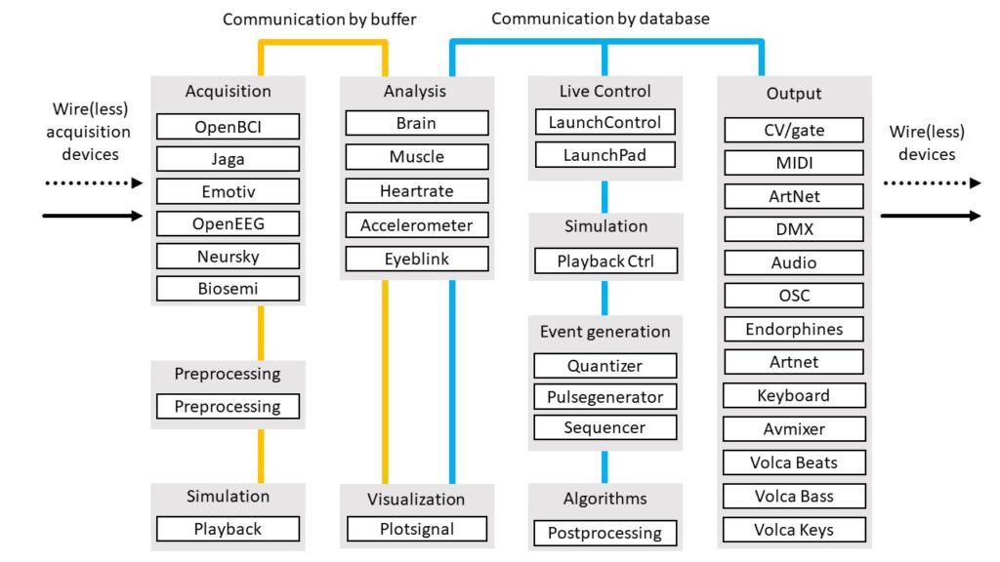

# Introduction

## Table of contents


**Figure 1.** _Example of complex modular synthesizer patch_

## Patching

```
[general]
debug=2
delay=0.1

[Redis]
hostname=localhost
port=6379

[fieldtrip]
hostname=localhost
port=1972
timeout=30

[input]
; the channel names can be specifies as you like
; you should give the hardware channel indices
channel1=1
channel2=2
channel3=3
channel4=4
channel5=5
channel6=6
;frontal=1
;occipital=2

[processing]
; the sliding window is specified in seconds
window=2.0

[band]
; the frequency bands can be specified as you like, but must be all lower-case
; you should give the lower and upper range of each band
delta=2-5
theta=5-8
alpha=9-11
beta=15-25
gamma=35-45
; it is also possible to specify the range using control values from Redis
redband=plotsignal.redband.lo-plotsignal.redband.hi
blueband=plotsignal.blueband.lo-plotsignal.blueband.hi

[output]
; the results will be written to Redis as "spectral.channel1.alpha" etc.
prefix=spectral
```

The spectral module calculates the spectral power in different frequency bands. Those frequency bands, and their name, are given in the .ini file. As you can see some are defined by numbers ('alpha=9-11'), while others use Redis keys ('redband=plotsignal.redband.lo - plotsignal.redband.hi'). In the latter case, the frequency band is determined (via Redis) by the plotsignal module, which can be used to visually select frequency bands. The spectral module also outputs (power) values to Redis, prefixed by 'spectral' (see [output] in the .ini file above).

As you can see, the .ini file includes other settings as well. You can find a default .ini in their respective directory, with a filename identical to the module. E.g. [module/spectral](https://github.com/eegsynth/eegsynth/tree/master/module/spectral) contains [spectral.py](https://github.com/eegsynth/eegsynth/tree/master/module/spectral/spectral.py) and [spectral.ini](https://github.com/eegsynth/eegsynth/tree/master/module/spectral/spectral.ini). Initialization files can be edited with any text editor but should be saved in a separate 'patch directory', in which you store all the .ini files belonging to one patch. This helps organizing your patches as well as your local git repository, which will then not create conflicts with the remote default .ini files.

## Data acquisition and communication

The EEGsynth uses the FieldTrip buffer to exchange eletrophysiological data between modules. It is the place where raw (or processed) data is stored and updated with new incoming data. For more information on the FieldTrip buffer, check the [FieldTrip documentation](http://www.fieldtriptoolbox.org/development/realtime/buffer). Note that the FieldTtrip buffer allows parallel reading of data. Some modules, such as the _spectral_ module, take data from the FieldTrip buffer as input and output values to the Redis buffer. Other modules take care of the data acquisition, interfacing with acquisition devices and updating the FieldTrip buffer with incoming data. We typically use the affordable open-source hardware of the [OpenBCI ](http://openbci.org/) project for electrophysiological recordings. However, EEGsynth can also interface with other state-of-the-art commercial devices using FieldTrip's [device implementations](http://www.fieldtriptoolbox.org/development/realtime/implementation).

## Controlling external software and hardware

The purpose of the EEGsynth is to control exernal software and hardware with electrophysiological signals. Originally developed to control modular synthesizers, the EEGsynth supports most protocols for sound synthesis and control, such as [CV/gate](https://en.wikipedia.org/wiki/CV/gate), [MIDI](https://www.midi.org/), [Open Sound Control](http://opensoundcontrol.org/introduction-osc), [DMX512](https://en.wikipedia.org/wiki/DMX512) and [Art-Net](https://en.wikipedia.org/wiki/Art-Net). These modules are prefixed with 'output' and output values and events from Redis to its protocol. Redis can also be accessed directly, e.g. in games using [PyGame](https://www.pygame.org/news). Rather than interfacing with music hardware, output to [Open Sound Control](http://opensoundcontrol.org/introduction-osc) can be used to control music software such as the remarkable open-source software [Pure Data](https://puredata.info/), for which one can find [many applications](https://patchstorage.com/platform/pd-extended/) in music, art, games and science.

## Summary

To summarize, the EEGsynth is an open-source code-base that functions as an interface between electrophysiological recordings devices and external software and devices. It takes care for the analyis of data on the one hand, and the translation into external protocols on the other. This is done in a powerful, flexible way, by running separate modules in parallel. These modules exchange data and parameters using the FieldTrip buffer and Redis database, respectively. This 'patching' is defined using text-based initialization files of each module. The EEGsynth is run from the command-line, without a GUI and without visual feedback (except for the plotting modules), and interaction using MIDI controllers, rather than computer keyboards. The upside is that the EEGsynth is easily customized and expanded, has the true feel and fucntion of a real-time feedback system, and can be light enough to run e.g. on a Raspberry-Pi (i.e. on Raspian). Below you can see the current (actually, already outdated) collection of modules included in the EEGsynth, showing the two different ways of communication: via the FieldTrip bugger (data) and via Redis (control values and parameters).



**Figure 3.** _Visual depiction of communication between modules via either the FieldTrip buffer for raw data (yellow) or via the Redis database (blue) for output and input parameters._

## Contributing

It is strongly advised to work within you own cloned repository and keep up to date with EEGsynth commits, as the EEGsynth is in constant development.

- For installation please follow our installation instructions for [Linux](https://github.com/eegsynth/eegsynth/blob/master/doc/installation-linux.md), [macOS](https://github.com/eegsynth/eegsynth/blob/master/doc/installation-macos.md) and [Windows](https://github.com/eegsynth/eegsynth/blob/master/doc/installation-windows.md). Please note that Windows and macOS are not actively supported. Linux is the main target, partly because we want the EEGsynth to be compatible with the [Raspberry Pi](http://raspberrypi.org/), partly because some Python libraries do not support Windows, and partly because we rely on command-line interface anyway.
