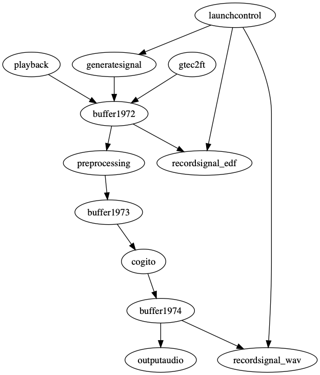

Cogito
======

This is the set of patches for the Cogito project. These were used at the Overview symposium in Kerkrade (3 Nov 2017), at the Tec-Art conference in Rotterdam (7-11 Feb 2018) and at the Cogito presentation in the radio telescope in Dwingeloo (5 Nov 2018).

The EEGsynth was configured to run on two Raspberry Pi computers, dubbed the "greypi" and the "hifipi". Furthermore, a laptop was used for the EEG measurement and streaming the raw data.

The Windows laptop for the EEG measurement has the Gtec drivers installed and was is running the gtec2ft module. The greypi was running three FieldTrip buffers: one for the raw data from the 32-channel system, one for the preprocessed EEG data and one for the processed/multiplexed audio signal. The hifipi was running all processing, recording and audio output modules. It has a HiFiBerry audio "hat" that was used for the audio output.

Although the commit of the patches was only done after the performance in Dwingeloo, the version of the EEGsynth software that was used at the performances was not recently updated. The version used in Rotterdam and Dwingelo was af230841a803c0d7114f2698a6f3ad8318a1315a, with the latest change on "Sat Dec 16 15:27:14 2017". The only exception was cogito.py, which had some local changes related to the coding of the electrode positions. Functionally, it corresponded to the version resulting from git commit ffcf90dac5ef5d5b2ca28c730ac8f4b6be4e06bc.

## Schematic representation of the patch

The following visualizes the relation between the modules. The `redis` module is not displayed explicitly, but is omnipresent since most communication between modules goes over Redis.

